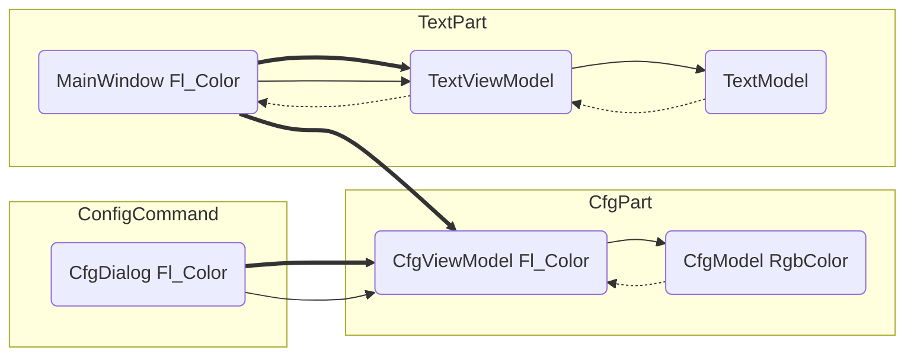
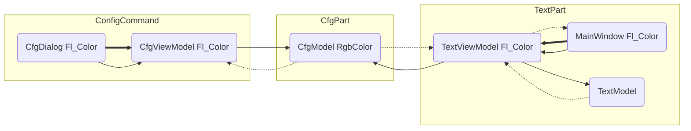

# A

```mermaid

graph LR
	cd("CfgDialog Fl_Color")
	cv("CfgViewModel Fl_Color")
	cm("CfgModel RgbColor")
	cd ==> cv
	cd --> cv
	subgraph ConfigCommand
		cd
	end
	subgraph CfgPart
		cv --> cm
		cm -.-> cv
	end
	tw("MainWindow Fl_Color")
	tv(TextViewModel)
	tm(TextModel)
	subgraph TextPart
		tv --> tm
		tm -.-> tv
		tw ==> tv
		tw --> tv
		tv -.-> tw
	end
	tw ==> cv
```

# B

```mermaid

graph LR
	cd("CfgDialog Fl_Color")
	cv("CfgViewModel Fl_Color")
	cm("CfgModel RgbColor")
	subgraph ConfigCommand
		cd ==> cv
		cd --> cv
	end
	subgraph CfgPart
		cm
	end
	cv --> cm
	cm -.-> cv
	tw("MainWindow Fl_Color")
	tv("TextViewModel Fl_Color")
	tm(TextModel)
	subgraph TextPart
		tv --> tm
		tm -.-> tv
		tw ==> tv
		tw --> tv
		tv -.-> tw
	end
	tv --> cm
	cm -.-> tv
```
